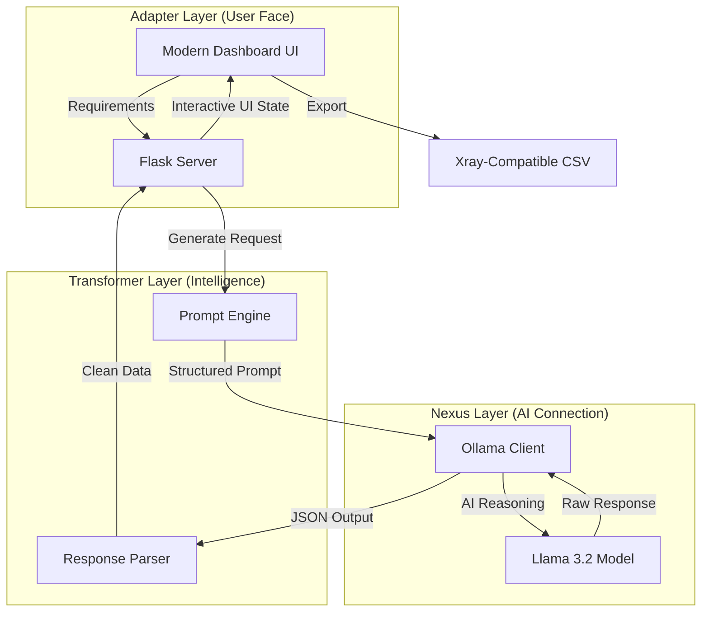

# 🤖 Local AI Testcase Generator

A powerful, privacy-first tool that uses local LLMs (via Ollama) to generate high-quality test cases directly from user stories or requirements. Designed with a **Classy Vibrant UI** and built-in **Jira Xray** export support.

---

## 🏗️ How it Works (A.N.T. Architecture)



---

## ✨ Features

- **Privacy First**: Everything runs on your local machine. No data is sent to the cloud.
- **Classy Vibrant UI**: A modern, SaaS-inspired interface designed for clarity and focus.
- **Xray Ready**: Export your generated test cases directly to CSV format, ready for Jira Xray import.
- **Advanced Prompting**: Uses specialized prompt engineering to ensure test cases include Pre-conditions, structured Steps, and Data requirements.
- **Micro-Interactions**: Smooth animations and real-time status updates for a premium feel.

---

## 🛠️ Tech Stack

- **Backend**: Python, Flask
- **AI Backend**: Ollama (llama3.2)
- **Data Handling**: Pandas
- **Frontend**: HTML5, Modern CSS3 (Inter & Plus Jakarta Sans fonts)
- **Infrastructure**: Virtual Environment (venv)

---

## 🚀 Getting Started

### 1. Prerequisites
- **Python**: 3.10+ installed.
- **Ollama**: Installed and running on your machine.
- **Model**: Pull the llama3.2 model:
  ```bash
  ollama pull llama3.2
  ```

### 2. Setup
Clone the repository and install dependencies:
```bash
# Activate virtual environment
source venv/bin/activate  # Mac/Linux

# Install requirements
pip install -r requirements.txt
```

### 3. Run the App
Start the Flask server on port 5001:
```bash
python -m app.adapter.app
```
Then open your browser to **http://127.0.0.1:5001**.

---

## 📂 Project Structure

```text
├── app/
│   ├── adapter/        # UI and Flask App
│   ├── nexus/          # Ollama Integration
│   └── transformer/    # Prompt & Parser Logic
├── tools/              # Utility & Test scripts
├── requirements.txt    # Dependencies
└── README.md           # You are here
```

---

## 📝 License
Built with ❤️ by [Atul Kumar](https://github.com/atul-kumar-sdet)
